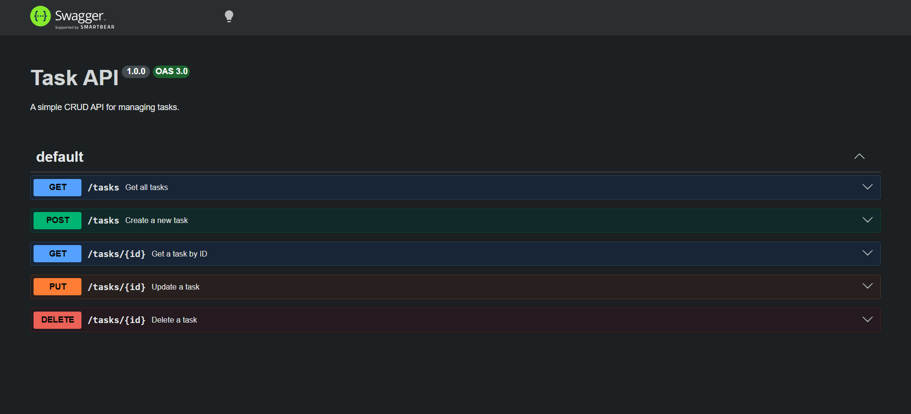

# Task API

A simple RESTful CRUD API built with **Node.js** and **Express.js**.

This project allows users to create, read, update, and delete tasks using HTTP requests. The API stores data in memory (no database) and includes interactive API documentation using Swagger UI.

---

## Features

- Create a task
- Read all tasks
- Read a task by ID
- Update a task
- Delete a task
- Swagger UI documentation
- In-memory data storage

---

## Technologies Used

- Node.js
- Express.js
- Swagger UI Express
- OpenAPI 3.0

---

## Installation

Clone the repository:

```bash
git clone https://github.com/Khizarkhan280/task-api.git
cd task-api
```

Install dependencies:

```bash
npm install
```

Start the server:

```bash
node server.js
```

The server will start at:

```
http://localhost:3000
```

Swagger documentation:

```
http://localhost:3000/docs
```

---

## API Endpoints

| Method | Endpoint | Description |
|---------|----------|-------------|
| GET | / | API information |
| GET | /health | Health check |
| GET | /tasks | Get all tasks |
| GET | /tasks/:id | Get task by ID |
| POST | /tasks | Create a task |
| PUT | /tasks/:id | Update a task |
| DELETE | /tasks/:id | Delete a task |

---

## Example cURL Request

Create a new task:

```bash
curl -i -X POST http://localhost:3000/tasks \
-H "Content-Type: application/json" \
-d '{"title":"Buy milk"}'
```

Example Response:

```http
HTTP/1.1 201 Created
Content-Type: application/json; charset=utf-8

{
  "id": 4,
  "title": "Buy milk",
  "done": false
}
```

---

## Swagger UI

Swagger documentation is available at:

http://localhost:3000/docs

### Screenshot



---

## Project Structure

```
task-api/
│
├── docs/
│   └── swagger-ui.png
├── node_modules/
├── server.js
├── openapi.json
├── package.json
├── package-lock.json
├── .gitignore
└── README.md
```

---

## Status Codes

| Status Code | Meaning |
|-------------|---------|
| 200 | OK |
| 201 | Created |
| 204 | No Content |
| 400 | Bad Request |
| 404 | Not Found |

---

## Author

Muhammad Khizar Khan